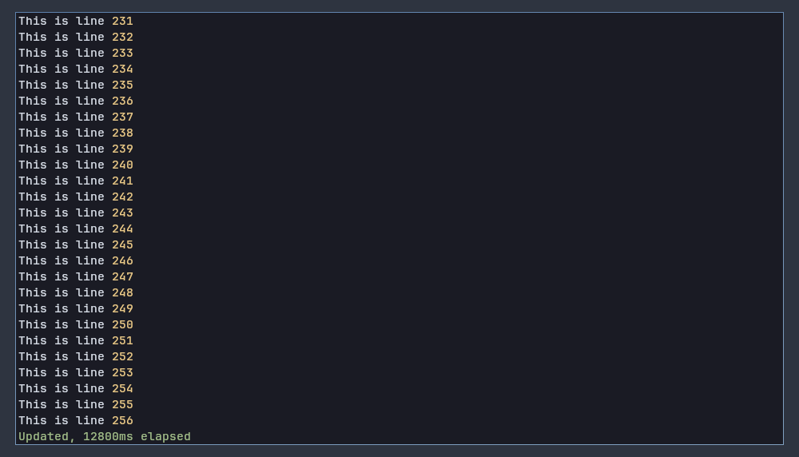

# ccanvas-scroll

Scrolling text display component for ccanvas.



## Usage

Make sure that `ccanvas-scroll` is installed. For example using the `cargo install` command.

```sh
cargo install --git https://github.com/ccanvas/ccanvas-scroll
```

Add it to your program, make sure that feature `scroll` is enabled in `libccanvas`.

```rs
client.spawn("scroll".to_string(), "ccanvas-scroll".to_string(), Vec::new()).await;
```

For more usage info, check page at [**`libccanvas/scroll`**](https://github.com/ccanvas/libccanvas/tree/master/src/features/scroll).

## Behaviour

When loaded, emits message `!scroll-ready`, or the constant `SCROLL_READY` in `libccanvas`.

### Environment variables

These are the accepted environment variables.

| Label       | Description                                        | Format (Default) |
| ----------- | -------------------------------------------------- | ---------------- |
| LINE_WRAP   | Whether to wrap to a new line when reaches the end | 0/1 (1)          |
| WORD_WRAP   | Whether whitespace is preferred for line wrapping  | 0/1 (0)          |
| MAX_ENTRIES | Maximum number of entries to retain                | Number (100)     |
